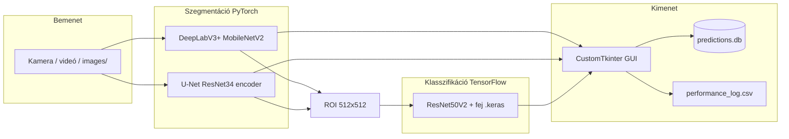

# Colon Polyp — Project Bible

> **Státusz:** élő dokumentum (2026-09-25).  
> **Cél:** egy helyen összefoglalni a terméket, a git/workflow szabályokat, a technikai állapotot és a minőségi elvárásokat.  
> **Nem klinikai eszköz:** döntéstámogató kutatási/fejlesztési szoftver; **nem** diagnózis, **nem** kezelési ajánlás, **nem** CE/FDA jellegű állítás.

---

## 1. Termék (Product)

### Mit csinál a rendszer?

Endoszkópos colon polip képeken **két lépcsős** elemzés:

1. **Szegmentáció** — polip régió kiszegmentálása (PyTorch).
2. **Bináris klasszifikáció** — a kivágott ROI alapján **JNET 1** vs **neoplasztikus (JNET 2a + 2b + 3)** (TensorFlow/Keras).

Az élő alkalmazás (`live_capture_app.py`) kamera / videó / képmappa forrásból pillanatképet vesz, futtatja a pipeline-t, megjeleníti az eredményt, és naplózza a latenciát (CSV + SQLite).

### Adat és címkék

| Forrás | Méret (notebook szerint) | Címkék |
|--------|-------------------------|--------|
| SZE belső adathalmaz | ~1073 kép (678 train + 189 val + 206 test, **páciens-ID alapú** felosztás) | JNET_1, JNET_2A, JNET_2B, JNET_3 (Excel: `images/PI-program-JNET-classes.xlsx` — **nem** a publikus repóban) |
| Kvasir-SEG (kiegészítő tanítás) | notebookban összevonva | szegmentációs maszkok |

**Bináris klasszifikációs cél** (app és üzleti értelmezés):

| Osztály index | JNET | Megjelenített név az appban |
|---------------|------|-----------------------------|
| 0 | 1 | Non-neoplastic (JNET 1) |
| 1 | 2a, 2b, 3 | Neoplastic (JNET 2a/2b/3) |

A négyosztályú JNET metaadat a notebookokban marad; a **production inference útvonal** bináris sigmoid + 0.5 küszöb.

### Mi nincs a repóban (szándékos)

- Klinikai képek, maszkok, betegazonosítók (PHI).
- Betanított súlyok alapértelmezetten lokálisan / exe mellé (lásd `deploy_exe/MODELLOK_MASOLASA.txt`).
- A `.gitignore` engedélyezi **két** szegmentációs checkpointot a repóban, de a teljes futtatáshoz a klasszifikátor `.keras` fájl is kell.

---

## 2. Git és release workflow

| Szabály | Részlet |
|---------|---------|
| **Alapértelmezett branch** | `master` |
| **Fejlesztés** | `feature/*`, `develop/*`, vagy `cursor/*` ágak; változás **PR-rel** |
| **`master` merge** | **Csak** Levente **explicit „igen”** után (go-live, modellcsere, regressziós tradeoff) |
| **Ezen dokumentum PR-ja** | Csak `docs/` — nincs modelltanítás, nincs automatikus merge |

Kapcsolódó docs a repóban: `README.md`, `REPRODUCIBILITY.md`, `APP_USAGE_HU.md`, `deploy_exe/README_HU.md`.

---

## 3. Technikai stack (állapot a repóban)

### 3.1 Összefoglaló diagram



### 3.2 Tanítás / kiértékelés (notebookok)

| Fájl | Modell | Backbone / könyvtár |
|------|--------|---------------------|
| `colon_short_szd_r.ipynb` | DeepLabV3+ | `network.modeling.deeplabv3plus_mobilenet`, 2 osztály, `output_stride=16` |
| `colon_short_szd_r U-net.ipynb` | U-Net | `segmentation_models_pytorch`, ResNet34 encoder |

- Adatbetöltő: notebookban definiált `KvasirSEGDataset` + SZE DataFrame (a README említi `datasets/custom_colon.py`-t; a jelenlegi repóban a dataset logika **a notebookokban** van).
- Upstream szegmentáció: [VainF/DeepLabV3Plus-Pytorch](https://github.com/VainF/DeepLabV3Plus-Pytorch) (MIT).
- Tanítási függőségek: `requirements_train.txt` (torch, torchvision, smp, sklearn, visdom, … — **verziók nincsenek pinelve**).

### 3.3 Inference / production útvonal (app)

**Belépési pont:** `python live_capture_app.py` (vagy PyInstaller `deploy_exe/` build).

| Komponens | Implementáció | Checkpoint / artefakt (lokális) |
|-----------|---------------|----------------------------------|
| DeepLabV3+ | `deeplabv3plus_mobilenet`, `NUM_CLASSES=2`, input **513×513** | `checkpoints_0409/best_model_0409_epoch_31.pth` |
| U-Net | `smp.Unet(encoder_name="resnet34", classes=1)` | `checkpoints_unet/best_model_epoch_22.pth` |
| Klasszifikátor | `tf.keras.models.load_model`, sigmoid, küszöb 0.5 | `classificator_models/cnn_s2_lr2e4_tb_os.keras` (preferált) vagy legacy `resnet50v2_polyp_20260217_131050.keras`; override: `CLASSIFIER_MODEL_PATH` |
| Eszköz | PyTorch: `cuda` ha elérhető, else `cpu`; TF: GPU tiltva az appban (CPU klasszifikáció) | — |

**Feldolgozási lépések** (`MedicalAnalyzer.analyze`):

1. BGR → RGB, resize/center crop 513, normalizálás (ImageNet).
2. Szegmentáció → maszk → vizualizáció + ROI (bbox, 512×512).
3. Klasszifikáció a ROI-n (ha van polip maszk).
4. Napló: `performance_log.csv` (pre/seg/post/cls ms), `saved_results/predictions.db`.

### 3.4 UI és deployment

| Elem | Leírás |
|------|--------|
| **GUI** | CustomTkinter (`live_capture_app.py`): élő feed, Capture & Analyze, DeepLab ↔ U-Net váltás, szimulációs mód |
| **Windows** | `pygrabber` (DirectShow kameralista); `scripts/install_dev.ps1` |
| **Exe** | `deploy_exe/live_capture_app.spec`, `build_onedir.ps1` — modellek az exe **mellé**, nem beágyazva |
| **Python** | Javasolt **3.11.x** (dokumentáció: zenbook_venv 3.11.5) |

### 3.5 Függőségek — „mennyire friss?”

- `requirements_app.txt` és `requirements_train.txt` **nem pinelnek** konkrét torch/tensorflow patch verziókat → `pip install` időpontjában letöltött wheel-ek (CPU vs CUDA külön választandó: [pytorch.org](https://pytorch.org/)).
- **Heterogén stack:** PyTorch (szeg) + TensorFlow (cls) egy processben — DLL/kompatibilitás Windows-on kritikus (exe build dokumentálva).
- Repo frissesség (git): utolsó releváns commitok a checkpoint útvonalak és README összehangolására fókuszálnak; a notebookok a szakdolgozati tanítási állapotot tükrözik.

### 3.6 Egyéb mappák

- `network/` — DeepLabV3+ implementáció és backbones.
- `utils/ext_transforms.py` — előfeldolgozás (app + notebook).
- `datasets/` — főleg upstream VOC/Cityscapes példák + `data/train_aug.txt` (nem a SZE pipeline központi része).
- **Automatizált tesztek:** nincs kötelező pytest/CI suite a repóban (lokális `verify.py` / `test_load.py` gitignore alatt).

---

## 4. Célok (Goals)

### Közeli (near-term)

1. **Gyors laptop inference** — diszkrét GPU (CUDA) és integrált GPU / CPU profilok mérése; `performance_log.csv` mint baseline.
2. **Pontosság nem regresszálhat** — sebesség-optimalizálás (quantization, ONNX, kisebb encoder, batch=1 tuning) csak **A/B mérés** után, ugyanazon holdout/test spliten.
3. **Stabil Windows futás** — PyInstaller onedir + modellfájl-csere modellfrissítéshez build nélkül.

### Közép-/hosszú táv

1. **Multimodális LLM fine-tune** — szöveg + kép (jelentés, kontextus, endoszkópos meta); külön kutatási ág, nem helyettesíti automatikusan a jelenlegi CNN pipeline-t.
2. **Gazdagabb kiértékelés API-n keresztül** — batch eval, külső benchmark szolgáltatás, verziózott metrikák (JSON), reproducible run ID.
3. **Egységesített dataset modul** — SZE loader kiszervezése notebookból (pl. `datasets/custom_colon.py` pótlása).

---

## 5. Minőség és kísérletezés (Quality)

### Baseline kötelező modellcsere előtt

Rögzítsd **ugyanazon** teszthalmazon (SZE test ~206 kép, páciens-szintű split a notebookban):

| Réteg | Javasolt metrikák |
|-------|-------------------|
| Szegmentáció | Dice, IoU (notebook: validációs loop) |
| Klasszifikáció | Accuracy, sensitivity/specificity, ROC-AUC (bináris 1 vs 2a+2b+3) |
| Latencia | `performance_log.csv` — Total, Seg, Classification ms (hardver + modell verzió szerint címkézve) |

### A/B protokoll

- **A** = jelenlegi production checkpointok (DeepLab epoch 31, U-Net epoch 22, preferált `.keras`).
- **B** = jelölt új modell.
- Azonos preprocessing (`INPUT_SIZE=513`, classifier 512×512).
- Döntés: Levente + Colon Polyp Developer (regresszió vs sebesség).

### Tesztek (ahol értelmes)

- Modell betöltés smoke test (checkpoint + keras path).
- Split integrity (`verify_split` logika a notebookból — kiszervezhető scriptbe).
- UI smoke: szimulációs mód `images/` mappával.
- Új CI esetén: **ne** futtasson tanítást PR-ban; csak lint/smoke.

---

## 6. Biztonság, adatvédelem, operáció

| Téma | Szabály |
|------|---------|
| **PHI / titkok** | Nincs klinikai kép, betegazonosító, API kulcs, jelszó a gitben. `.env` / lokális modellek csak gépen. |
| **Cloud Agent (Cursor)** | **Fast OFF** — ne gyorsítsunk fel olyan futást, ami modellt tanít vagy érzékeny adatot érint. |
| **Kontextus** | Hosszú Cursor szálak: ez a `docs/PROJECT.md` + `README.md` az onboarding; új szálban hivatkozz ide. |
| **Naplók** | `saved_results/`, `performance_log.csv` lokálisak; ne commitoljuk. |

---

## 7. Szerepkörök (Roles)

| Szerep | Felelősség |
|--------|------------|
| **Colon Polyp Developer** | Kód, ML pipeline, notebookok, app, metrikák, PR-k |
| **CEO** | Napi operatív irány, prioritások, üzleti döntések |
| **Levente** | Go-live, `master` merge jóváhagyás, modell-regresszió vs sebesség tradeoff, klinikai/partnerségi kontextus |

---

## 8. Gyors parancsok

```bash
# App (fejlesztő)
python -m venv .venv && source .venv/bin/activate  # Windows: .venv\Scripts\activate
pip install -r requirements_app.txt
python live_capture_app.py

# Tanítás / repro (notebook)
pip install -r requirements_train.txt
jupyter notebook colon_short_szd_r.ipynb
```

---

## 9. Dokumentum történet

| Dátum | Változás |
|-------|----------|
| 2026-09-25 | Első Project Bible — repó felmérés (notebookok, `live_capture_app.py`, deploy, deps) |
